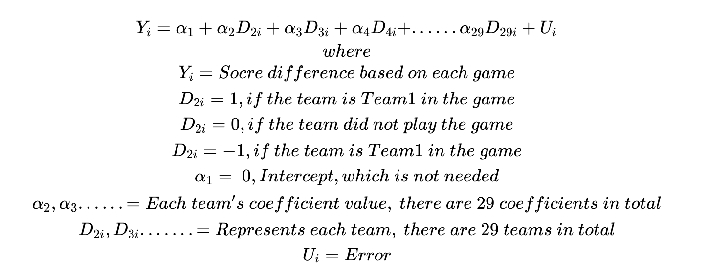
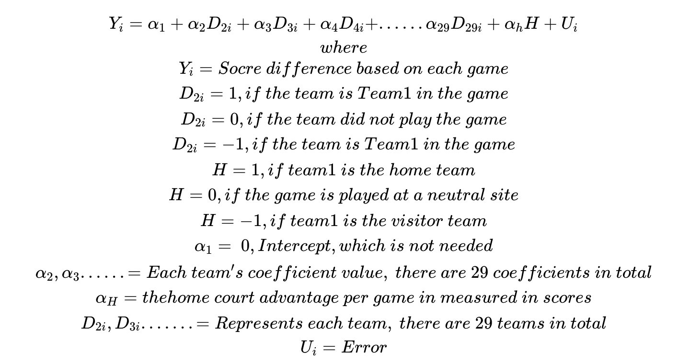

```{r setup, include=FALSE}
knitr::opts_chunk$set(echo = TRUE)
```

# Abstract

Nowadays, the popularity of the NBA along with the penetration of gambling ideas is rising all around the world. More and more fans prefer to bet on sports gambling. People want to predict the final score difference for each individual game. In addition, there are many either superficial or underlying factors that will affect the game’s result.  The central claim of this article is to establish a reliable model that could predict each game’s result by extracting and analyzing previous games’ outcomes. The major analysis is done by modeling and exploratory data analysis, and is composed of several graphical methods. For the modeling part, ideally the model could predict the games’ score differences by analyzing previous dozens of games’ data sets. The database consists of a single season 2016-2017 on Goldsheet website to explore more analysis. Then step by step checking and demonstrating to prove the feasibility and precision of the model.  The model will collect and analyze the data information, like rebounds, teams, assists, turnovers, three points, free throws, blocks, and injury, from Season 2016-2017. The model will predict the future game result in Season 2016-2017 by using each team’s previous game result in this season. This article indicates the idea of linear regression model to find the best fit by comparing the correlation strength of each variable, which include the home-field advantage, teams’ technical statistics, and injury data, to the result of a game. The model final outcomes implies that the game’s result has the most correlation with the home-field advantage and player injury; however, team’s basic technical statistics, included the rebounds, blocks, turnovers, free throws, three points, and assists, have low correlation coefficient with the result to demonstrate that they are not significant to a game’s result.  


# 1.  Introduction

Basketball, ranked at the third place on the world's ten most popular ball games, has around 2.2 billion fans all around the world. In all basketball leagues, the NBA, the National Basketball Association, is obviously the most popular basketball game in all countries. 30 teams participate in the NBA each year, and they are divided into two parts, named Western Conference and Eastern conference, and each of them contains 15 teams. Each season is also divided into two separate parts, the regular season, in which each team will play 82 games in total with others, and the playoff. The playoff only contains the best 16 teams, with eight teams each from the Eastern Conference and Western Conference, and they will compete for the final championship.

The NBA's audience is so large that the gambling industry is on the rise, and one of the gamble types is point spread betting. Point spread is a bet on the margin of victory in a game(1). People bet on whether the stronger team could win by point spread over the weaker team. Sometimes, winners’ profits even reach up to $2,500(2). Thus, accurately predicting the outcome of a match can be very rewarding, that leads to more research nowadays, especially focusing on the aspect of sports gambling and point spreads prediction.  

Common sense dictates that the ability of the players on the pitch can make a big difference to the outcome of a match. This research is dedicated to exploring factors that affect score difference per game, such as home-field advantages, turnovers, three points, injury and so on. Several models have been tried and compared in this study.

This paper is organized in five sections that describe the process and result of the research project. Section 2 describes the data, data cleaning process and merging; Section 3 presents the exploration and analysis;  Section 4 summarizes the work that group did and the observations that were found; Finally, section 5 will give all the references that were used for this project. 

# 2.  Methods (Data Cleaning)

## Data description:

In this study, the database for NBA season 2016-2017 is downloaded as an html document from Goldsheet webpage. Unfortunately, this html document includes a lot of messy code with dirty data. Thus, data cleaning is the first crucial step to address with. The first thing to do is to figure out a data frame containing all the information needed for the following research: date of games, names of team 1 and team 2, point spread, scores of team 1 and team 2, score differences(scores of team 1 minus that of team 2), and locations.

The first observation is that there are more than two types of locations. Besides “H” which stands for “home game'' and “V” which stands for “visitor game”, numerical numbers appeared following them. Actually, these are the numbers of overtime periods, usually 5 minutes for each overtime period of play according to the official NBA website(https://official.nba.com/rule-no-5-scoring-and-timing/). In addition, the team name is also one checkpoint. In Goldsheet data, one individual team could be expressed differently. One example is that the team “LA Lakers” has been shown not only as “LA Lakers”, but also as “LA Laker” as a mistake. Thus, addressing different formatting names and canceling different versions of one team name is necessary. Furthermore, the raw data presents names of team 1 and team 2 in different formats. For the convenience of future studying, names of team 2 are adjusted to be the same as team 1. Last but not least, the data is internally duplicated. The method used here to deal with this problem is to firstly select Team 1 alphabetically, and secondly Team 2. The result is shown below, which only relies on the arrangement of the team 1 names and team 2 names in alphabetical order. If the team 1 name is “ATLANTA HAWKS”, team 2 will arrange the names alphabetically with “B”, since there are no other teams starting with “A”. If the team 1 name is “BOSTON CELTICS”, which starts with letter “B”, the matching team 2 will start with “B” if there is another team name starting with “B”. Therefore, “ATLANTA HAWKS” will never appear in the list of Team 2 and “WASHINGTON WIZARDS”, which is the last team alphabetically, will never be Team 1. Consequently, all duplicated rows that represent the same game will be abandoned. One of the advantages of this method is that the locations of games are randomly selected, which will be of critical significance in the following study of home-field advantages. The columns are listed in the following order: Date of the Game, Team1 name, Team2 name, Pointspread of the Game, Team1 Score, Team2 Score, score difference between Team1 and Team2, The Location of the Game
```{r GoldSheet, echo=FALSE}
gs2017 <- read.csv('Data/NBA 2017.csv', stringsAsFactors = FALSE)
gs2017 <- gs2017[, 2:ncol(gs2017)]
head(gs2017, 10)
```


Additionally, the data of three points, rebounds, free throws, assists, blocks, turnovers of each game in 2016-2017 is downloaded from the Basketball Reference website. On Basketball Reference website, the per game stats data are organized into separate csv files by team name and season. The key point of cleaning data of variables of games is to select exactly the same games as those that were chosen above. Accordingly, the cleaned data can be built into the model and makes sense. The columns are listed in the following order: Date of the game, Team1 name, Team2 name, Team1 score, Team2 score, Team1 Field Goals, Team1 Field Goal Attempts, Team1 Field Goal Percentage, Team1 3-Point Field Goals, Team1 3-Point Field Goal Attempts, Team1 3-Point Field Goal Percentage, Team1 Free Throws, Team1 Free Throw Attempts, Team1 Free Throw Percentage, Team1 Offensive Rebounds, Team1 Total Rebounds, Team1 Assists, Team1 Steals, Team1 Blocks, Team1 Turovers, Team1 Personal Fouls, Team2 Field Goals, Team2 Field Goal Attempts, Team2 Field Goal Percentage, Team2 3-Point Field Goals, Team2 3-Point Field Goal Attempts, Team2 3-Point Field Goal Percentage, Team2 Free Throws, Team2 Free Throw Attempts, Team2 Free Throw Percentage, Team2 Offensive Rebounds, Team2 Total Rebounds, Team2 Assists, Team2 Steals, Team2 Blocks, Team2 Turovers, Team2 Personal Fouls, 
```{r Per Game Stats, echo=FALSE}
gameStats <- read.csv('Data/gameStats16-17.csv', stringsAsFactors = FALSE)
gameStats <- gameStats[, 2:ncol(gameStats)]
head(gameStats[, c(1, 39, 40, 5:38)], 10)
```
 
 
Players per game stats (field goals, three points, free throws, assists, blocks, turnovers, minute played, turnover, plus/minus) in 2016 -2017 is also downloaded from the Basketball Reference website. On the website, each csv contains the per game stats for one player in one season. Concatenating all csv files together to construct a single dataframe that contains all per game player stats for the 2016-2017 season. Some rows contain "Did Not Dress", "Not With Team", "Inactive", "Player Suspended", "Did Not Play”, which means the player did not play that game. Removing these rows gives clean data. The columns are listed in the following order: Date of the game, the Player name, Team Name of the player, Minutes Played, Field Goals, Field Goal Attempts, Field Goal Percentage, 3-Point Field Goals, 3-Point Field Goal Attempts, Free Throws, Free Throw Attempts, Free Throw Percentage, Offensive Rebounds, Defensive Rebounds, Total Rebounds, Assists,  Steals,  Blocks, Turnovers, Personal Fouls, Points, Game Score, Plus/Minus.
```{r Player Stats, echo = FALSE}
playerStats <- read.csv('Data/PlayerStatsPerGame.csv', stringsAsFactors = FALSE)
playerStats <- playerStats[, c(4, 32, 6, 11:31)]
head(playerStats)
```


The injury data is scrapped from Pro Sports Transactions Archive website. The data contains five columns: Date, Team, Acquired, Relinquished, and Note. Every row of the data indicates an event about a player. 
``` {r injuryExample1, echo = FALSE}
injury_raw <- read.csv('Data/injury1617.csv', stringsAsFactors = FALSE)
LeonardInjury <- injury_raw[injury_raw$Acquired == 'Kawhi Leonard' |  
             injury_raw$Relinquished == 'Kawhi Leonard',]
head(LeonardInjury, 10)
```
If the a relinquishing of a player is immediately  followed by the acquisition of this player, we regard such relinquishing-acquisition pair as a player injury-and-recovery event. All other rows are disregared as these rows are describing what happend for this player during the game, and we cannot have this infomation before the game happens. The player relinquishing date is the date he will not be able to play the game and the games after this date, whereas the player acquisition date is the date he will be able to play the game and he will be able to play the following games. In the example below, Kawhi Lenonard is not on the court from 2017-02-06 to 2017-02-07, and he will be avalible for the game that happens on 2017-02-08 or after this date.
``` {r injuryExample2, echo = FALSE}
LeonardInjury[c(5,6), ]
```
Pairing every player’s Relinquishing and Acquisition produces a dataframe that every row is an injury event of a player including when he got injured and when he recovered (Team, Player, GoneDate, BackDate). the GoneDate and BackDate of a player are the relinquishing date and the a cquisition date for the player.
``` {r injuryExample3, echo = FALSE}
injurylist <- read.csv('Data/injurylist.csv', stringsAsFactors = FALSE)
head(injurylist)
```


## Exploratory Data Analysis:

__Home-Field Advantage :__

Home-field advantage refers to the benefit given to the home team over the visiting team(https://en.wikipedia.org/wiki/Home_advantage). It is reasonable because the home game team should have some advantage on whether players are prepared mentally or they are more familiar with the home game field. The home team is inclined to have more fans to come to the court to support them, which will give them the strongest confidence and intense disturbance for the opponent team. In the case, if the team “LA Lakers” has an obvious higher score difference when they play at home than they play as a visitor on average, then the “home-field advantage” variable is assumed to play a role here.

```{r Home-Field Advantage1, echo= FALSE}
m <- read.csv("Data/NBA 2016-2017(2618).csv", stringsAsFactors = FALSE)
len_team <- length(unique(m$Team1))
hscorediff <- rep(NA, len_team)
vscorediff <- rep(NA, len_team)
for (i in 1:len_team){
  thisteam <- unique(m$Team1)[i]
  hscorediff[i] <- mean(m$scorediff[m$Team1 == unique(m$Team1)[i] &
                                      m$Location == "H"])
  vscorediff[i] <- mean(m$scorediff[m$Team1 == unique(m$Team1)[i] &
                                      m$Location == "V"])
}
# plot(hscorediff-vscorediff)
plot(density(hscorediff - vscorediff, adj = 2), 
main="Differences of scorediff between home and visit", sub = 'Figure 1: Comparison of the mean score difference based on game status')

abline(v = 0, col = 'red')
```

After the data cleaning process mentioned above, the total numbers of home games, visitor games and natural games are 644, 642 and 3 respectively. By plotting the density of differences of 30 teams’ score differences between home games and visitor games, it can be easily seen that the mean is greater than 0. It is shown in Figure 1, which implies that teams tend to perform better at home than play as a visitor. To calculate the mean average score differences based on locations, it is interesting to notice that home-field advantage seems to give the home team higher scores by 3.07 points. According to Marshall(2007), he also reviewed the significance of home-field advantage, and calculated the average score difference between home and away at about 3.5 points, which is quite similar. He even finally concluded that home teams have 60% confidence to win the game. 

__Game Statistics :__

Despite the first major variable home-field advantage, there are many other variables which could have influenced the result of a game. There are six indicators listed below: 

```{r Game Statistics, echo=FALSE, message=FALSE, warning=FALSE, paged.print=FALSE, results='hide'}
y <- read.csv("Data/cleaning_games2016-2017.csv", stringsAsFactors = FALSE)
x <- read.csv("Data/NBA 2016-2017.csv", stringsAsFactors = FALSE)
m <- read.csv("Data/NBA 2016-2017(2618).csv", stringsAsFactors = FALSE)

par(mfrow = c(2,3))

##### EDA for 3 points shoots
plot(jitter(x$scorediff) ~ jitter(y$TPdiff), sub = 'Total Three Points')
ThreePoint <- lm(x$scorediff ~ y$TPdiff)
# summary(ThreePoint)
abline(-0.23788, 1.45652, col = 2, lwd = 3)
abline(0, 1)

##### EDA for Rebounds
b1 <- plot(jitter(x$scorediff) ~ jitter(y$TRBdiff), sub = 'Total Rebounds')
Rebounds <- lm(x$scorediff ~ y$TRBdiff)
# summary(Rebounds)
b1 <- abline(0.80243, 0.76137, col = 2, lwd = 3)
abline(0, 1)


##### EDA for Free Throws
plot(jitter(x$scorediff) ~ jitter(y$FTdiff), sub = 'Total Free Throws')
FreeThrow <- lm(x$scorediff ~ y$FTdiff)
# summary(FreeThrow)
abline(0.17894, 0.33953, col = 2, lwd = 3)
abline(0, 1)


##### EDA for Assists
plot(jitter(x$scorediff) ~ jitter(y$ASTdiff), sub = 'Total Assists')
Assists <- lm(x$scorediff ~ y$ASTdiff)
# summary(Assists)
abline(0.27725, 1.25857, col = 2, lwd = 3)
abline(0, 1)


##### EDA for Blocks
plot(jitter(x$scorediff) ~ jitter(y$BLKdiff), sub = 'Total Blocks')
Blocks <- lm(x$scorediff ~ y$BLKdiff)
# summary(Blocks)
abline(0.6661, 1.1485, col = 2, lwd = 3)
abline(0, 1)


##### EDA for Turnovers
plot(jitter(x$scorediff) ~ jitter(y$TOVdiff), sub = 'Total Turnovers')
Turnovers <- lm(x$scorediff ~ y$TOVdiff)
# summary(Turnovers)
abline(0.44562, -0.57627, col = 2, lwd = 3)
abline(0, -1)


par()
```

In the Figure above, it contains six variables, which are the total three points, rebounds, free throws, assists,  blocks, and turnovers. Obviously, all of them do have a correlation with the final score differences. The first five are positively connected with score differences, while turnover is a negative factor. Among them, the free throw variable has the weakest correlation. In contrast, three points and assists have much higher coefficients, which means their additional change will have more impact on the score difference. This does make sense, because free throws could only get one point at a time; however, three points could gain three points per goal. Thus, the three points variable is more important. One more observation is that the assist variable has a steeper slope than the blocking and rebounding variables. This is because each single independent assist implies one score by someone in the team; however, rebounds and blocks could only give a sense of the team’s defensive ability being not bad. It is only an attack opportunity, and does not necessarily mean that the team will gain more points from them. Thus unsurprisingly, the indicator assist is directly related to scores that gain a high correlation; while the rebound and block variables are indirect to a team’s scores, which get lower correlation coefficients. Apart from those five variables, turnover is also important. The coefficient of turnover is negative, since when one team makes a turnover, they will give the opponent possession of the ball. The opportunity of the opponent’s score implies the loss of score differences. They could make a good defense that does not let the opponent score, or the opponent takes this opportunity to score, and make the score difference larger. 

__Injury :__

Injury is one of the key factors that affects the game results, especially the injury of a key player can have a huge impact on the game. For example, Kawhi Leonard from SPURS is injured and cannot play form 2017-05-16 to 2017-05-22 during the playoff games vs WARRIORS. After his injury, the SPURS loses the following games by a greater margin compared with Leonard is on the court. 
```{r InjuryHidden, echo=FALSE, message=FALSE, warning=FALSE, paged.print=FALSE, results='hide'}


injury <- read.csv('Data/injurylist.csv', stringsAsFactors = FALSE)
injury <- injury[, c(2, 3, 4, 5) ]

injury$GoneDate <- as.Date(injury$GoneDate)
injury$BackDate <- as.Date(injury$BackDate)

injury$Team <- toupper(injury$Team)

```
```{r Injury, echo = FALSE}

playerName <- "Kawhi Leonard"
playerInjury <-  injury[injury$Player == playerName , ]
playerInjury[9, ]
playerGame <- gs2017[gs2017$Team1 == 'SAN ANTONIO SPURS' | gs2017$Team2 == 'SAN ANTONIO SPURS', ]
playerGame$Date_of_game <- as.Date(playerGame$Date_of_game) 
playerGame <- playerGame[order(playerGame$Date_of_game, decreasing = FALSE),]
tail(playerGame, 10)

```
 For Zaza Pachulia, an average player from WARRIORS, his absent from 2017-05-20 to 2017-06-01 has no obvious impact on WARRIORS performance. 
```{r injury3, echo = FALSE}
playerName <- "Zaza Pachulia"
playerInjury <-  injury[injury$Player == playerName , ]
playerInjury[3, ]
playerGame <- gs2017[gs2017$Team1 == 'GOLDEN STATE WARRIORS' 
                     | gs2017$Team2 == 'GOLDEN STATE WARRIORS', ]
playerGame$Date_of_game <- as.Date(playerGame$Date_of_game) 
playerGame <- playerGame[order(playerGame$Date_of_game, decreasing = FALSE),]
tail(playerGame, 10)

```
These examples show that injury may have an impact on game results, and who got injured matters a lot.

# 3.  Model Building
```{r Read All Variables, echo = FALSE}
# These are for 1309
xxMA1309 <- read.csv('Data/variable1309.csv', stringsAsFactors = FALSE)
xxMA1309 <- xxMA1309[, 2:ncol(xxMA1309)]
teamMM1309 <- xxMA1309[, 9:38]
teamMM1309 <- matrix(unlist(unlist(teamMM1309)), ncol = 30, byrow = FALSE)
colnames(teamMM1309) <- names(xxMA1309)[9:38]

sdif1309 <- xxMA1309$Score1 - xxMA1309$Score2

xxMA1309$hv <- 0
xxMA1309[xxMA1309$Location == 'H', 'hv'] <- 1
xxMA1309[xxMA1309$Location == 'V', 'hv'] <- -1

# These are for 1260
xxMA <- read.csv('Data/allVariable.csv', stringsAsFactors = FALSE)
xxMA <- xxMA[, 2:ncol(xxMA)]
xxMA$dt <- as.Date(xxMA$dt)

sdif <- xxMA$s1 - xxMA$s2
ptdif <- xxMA$t2tp - xxMA$t1tp 
statMM <- matrix(unlist(unlist((xxMA[, 7:22] - xxMA[, 23:38]))), 
                 ncol = 16, byrow = FALSE)
colnames(statMM) <- c('FGdif', 'FGAdif', 'FGPdif', '3Pdif', '3PAdif', '3PPdif', 
                'FTdif', 'FTAdif', 'FTPdif', 'ORBdif', 'RBdif', 'ASTdif', 
                'STLdif', 'BLKdif', 'TOVdif', 'PFdif')
statMM6 <- statMM[, c('3Pdif', 'RBdif', 'FTdif', 'ASTdif', 'BLKdif', 'TOVdif')]
teamMM <- xxMA[, 47:76]
teamMM <- matrix(unlist(unlist(teamMM)), ncol = 30, byrow = FALSE)
colnames(teamMM) <- names(xxMA)[47:76]

```


Building a linear model to predict the future game point spread is complicated since there are so many factors. In this study, only several variables are chosen, including 30 teams as a whole, home-field advantages, six indicators of each team per game mentioned above, and injury information. Four models have been tried and will be illustrated in detail below. All models are built to predict game results, i.e. score differences. 

__Model 1: Model with only 30 teams__

In this model, only the competence of 30 basketball teams is considered. The model is built by making up a matrix with 1309 rows representing all games from the season 2016-2017, and 30 columns, which stand for 30 teams. Here, 29 dummy variables are needed. The formula is listed below. 
<!-- $$ -->

<!-- Y_ {i} = α_{1} + α_{2}D_{2i} + α_{3}D_{3i}+ α_{4}D_{4i}+...... α_{29}D_{29i}+U_{i} \\ -->
<!-- where \\ -->
<!-- Y_ {i} = Socre \ difference \ based \ on \ each \ game\\ -->
<!-- D_{2i} = 1, if \ the \ team \ is \ Team1 \ in \ the \ game \\ -->
<!-- D_{2i} = 0, if \ the \ team \ did \ not \ play \ the \ game \\ -->
<!-- D_{2i} = -1, if \ the \ team \ is \ Team1 \ in \ the \ game \\ -->
<!-- \\ -->
<!-- {\displaystyle  α_{1}= \ 0 ,Intercept, which\ i s\ not \ needed}\\ -->
<!-- {\displaystyle  α_{2}, α_{3}......= Each\ team's\ coefficient\ value,\ there\ are\ 29\ coefficients \ in\ total}\\ -->
<!-- {\displaystyle  D_{2i},D_{3i}.......= Represents\ each \ team,\ there\ are\ 29\ teams\ in \ total  }\\ -->
<!-- {\displaystyle  U_{i}= Error} -->

<!-- $$ -->

The basic idea of making this dummy variable is to assign the team who is team 1 a value of 1, assign the team who is team 2 a value of -1, and assign all the other team’s the value of 0. For instance, if one of the rows represents the game “LA Lakers” versus “Boston Celtics”, the result in the dummy variable matrix will be shown the positive number 1 under the LA Lakers column corresponding to that date of game, and negative number 1 will be presented under the Boston Celtics column corresponding to the date of the game. Now, at the specific row, team 1 “LA Lakers” will have number one, team 2 “Boston Celtics” will have a number -1, and spontaneously the rest of other teams will all have number 0 for that row. This is because for this specific game, only two teams have participated, any other teams does not have any relation to that game at all. Thus, they all get number 0 for this row of game. 

By running this model, as shown by the formula above , a positive intercept exists, which means the model will give extra points to team 1 but not team 2. 

However, this is wrong here. In the case of not considering home-field advantages, if the status of team 1 and team 2 are reversed, the absolute value of the score difference will be different, which actually should not be. In other words, the formula of this model should pass the original point.  Thus, the model needs to delete the intercept by -1 in model construction code. After that, there is one team variable that states NA value, and the team “Washington Wizards” in this model is actually being a role of a standard team. Each other 29 teams will be compared to the Washington Wizards and get a team value from it. Thus, the Washington Wizards will be dismissed from the model, and be used as a comparative variable to help make other teams’ value more visualized. It is all the coefficients of other 29 teams that suggest the relative competence of this team against “Washington Wizards”'. For example, the coefficient of Golden State Warriors is 11.1106, which implies that this team plays much better than Washington Wizards. It is a good team and keeps doing great. The corresponding p-value is also quite small. The coefficient of Memphis Grizzlies is -0.4113, which shows that these two teams are really evenly matched, though Memphis is a little bit inferior. The multiple R-squared is 0.177, with residual standard error 13.04. 

```{r model 1: 30teams, echo = FALSE}
model2<- lm(sdif1309 ~ -1 + teamMM1309[, 1:29])
summary(model2)
```


__Model 2: Model with 30 teams and home-court-advantage__

After analyzing variables of 30 teams, the linear model can be improved. The main purpose for this model is to combine teams with home-field advantages. Whether the game takes place at home or away will be considered. Similarly, the method of dummy variables is applied. Home games will be assigned 1, visit games will be assigned -1, and neutral games will be 0. Indeed, it is still a matrix with 1309 rows representing games, but only 1 column presenting the locations. Adding this variable directly after the formula above, the formula is shown below. 

<!-- $$ -->

<!-- Y_ {i} = α_{1} + α_{2}D_{2i} + α_{3}D_{3i}+ α_{4}D_{4i}+...... α_{29}D_{29i}+α_{h}H +U_{i} \\ -->
<!-- where \\ -->
<!-- Y_ {i} = Socre \ difference \ based \ on \ each \ game\\ -->
<!-- D_{2i} = 1, if \ the \ team \ is \ Team1 \ in \ the \ game \\ -->
<!-- D_{2i} = 0, if \ the \ team \ did \ not \ play \ the \ game \\ -->
<!-- D_{2i} = -1, if \ the \ team \ is \ Team1 \ in \ the \ game \\ -->
<!-- H = 1, if \ team1 \ is \ the \ home \ team \\ -->
<!-- H = 0, if \ the \ game \ is \ played \ at \ a \ neutral \ site \\ -->
<!-- H = -1, if \ team1 \ is \ the \ visitor \ team \\ -->
<!-- \\ -->
<!-- {\displaystyle  α_{1}= \ 0 ,Intercept, which\ i s\ not \ needed}\\ -->
<!-- {\displaystyle  α_{2}, α_{3}......= Each\ team's\ coefficient\ value,\ there\ are\ 29\ coefficients \ in\ total}\\ -->
<!-- {\displaystyle  α_{H}= the home \ court \ advantage \ per \ game \ in \ measured \ in \ scores}\\ -->
<!-- {\displaystyle  D_{2i},D_{3i}.......= Represents\ each \ team,\ there\ are\ 29\ teams\ in \ total  }\\ -->
<!-- {\displaystyle  U_{i}= Error} -->

<!-- $$ -->

After running this model, the result is shown below.

```{r model 2: 30teams and home advantage, echo = FALSE}
model2<- lm(sdif1309 ~ -1 + teamMM1309[, 1:29] + xxMA1309$hv)
summary(model2)
```
The key point requiring attention here is that there is one more row added: coefficient of the home-field advantage variable 3.0516, which is presented above. This is consistent with what has been calculated before. If one team plays at home, it tends to have an advantage of about 3 points. It is a significant difference, and this is an important factor when predicting the game results. 
 
In the summary result table, the coefficients of teams have exactly the same meaning as the original model. Compared with coefficients obtained from the original model, they all decrease somewhat. One of the reasons is that a new variable has been introduced and helped to explain the score difference. The residual standard error here decreases a little bit to 12.68, and the Multiple R-square rises to 0.2229. Both of these changes imply that the second model can fit better, and have higher accuracy. 
 

__Model 3: Model with  30 teams, home-court-advantages and 6 game statistics__

Based on the second model, the advanced purpose is to check the model result when there are more variables. In the exploratory data analysis, there is strong evidence that these six indicators: three points, rebounds, free throws, assists, blocks and turnovers, all have an impact on score differences. The expected result is that each variable would be significant with high correlation and contribute to the new model. However, the outcome is not satisfying. 
 
Firstly, start with constructing the model. To do this, only historical data and information could be used. In other words, the data for the match to be predicted cannot be taken into account. The method used here is to find the data of team 1 and team 2 in the last three matches and average them separately to predict the next match. Just take the rebound variable as an example. If team 1 had 6, 10, 8 rebounds and team 2 had 4, 8, 6 rebounds in their last three games respectively, then the average rebound for team 1 and team 2 would be 8 and 6. Their difference is 2,  which is the statistic that will be built into the model. Such a rolling method requires a re-selection of games, since the first several games lack historical data to use. After that, there are 1260 games left in total. Therefore, the matrix used here to build the model has 1260 rows.

After running the model, the result is surprising.
```{r model 3: 30teams, home-court-advantage, and 6 game statistics, echo = FALSE}
model2<- lm(sdif ~ -1 + teamMM[, 1:29] + xxMA$hv + statMM6)
summary(model2)
```
On the one hand, the figure shows that none of these 6 variables reveals significance to the model prediction. The coefficients of these 6 variables are all small with high p-values, which could lead to the assumption that the three points, rebounds, free throws, assists, blocks, and turnovers do not affect one game’s result a lot. This statement can be supported by using analysis of variance. [The figure]. The sum of squares of the six indicators is 7660, which is much smaller than other variables. This suggests that the new added six indicators does not well explain the score differences. On the other hand, the home advantage coefficient in this model stays nearly the same around 3 with high significance level. The coefficients of 30 teams also change upwards a little bit, with p-values decreasing. It is also due to the reason that new indicators have helped to explain the score difference, leading to less significance of original variables. Currently with this new model, residual standard error is 12.67, and multiple R-squared is 0.2286. Overall, this model has been improved a little bit with these new statistics, since residual standard error falls, and multiple R-squared rises.  


__Model 4: Model with  30 teams, home-court-advantages and player injury__

As shown in the  exploratory data analysis, injuries of players may hugely impact the game result, especially the injury of star players. Since model 3 does not provide significantly more information than model 2, we propose adding player injury information, based on model 2, to predict the score difference. 

To measure the impact of injured players, the player stats are used to determine if the player is important. As convention mentioned above to avoid the use of future information, the estimation of player statistics per game in one game is the average statistics per game of the player in the last 3 games. For example, Kawhi Leonard is absent from 2017-05-16 to 2017-05-22.
```{r model 4: 30 teams, home-court-advantages and player injury part1, echo = FALSE}
ij <- read.csv('Data/injuryExample.csv', stringsAsFactors = FALSE)
pi <- read.csv('Data/pinfoExample.csv', stringsAsFactors = FALSE)
xx <- read.csv('Data/xxMAExample.csv',  stringsAsFactors = FALSE)
ij <- ij[, 2:5]
ij$GoneDate <- as.Date(ij$GoneDate)
ij$BackDate <- as.Date(ij$BackDate)
pi <- pi[, 2:ncol(pi)] 
xx <- xx[, 2:ncol(xx)]
xx$dt <- as.Date(xx$dt)

ij[ij$Player == "Kawhi Leonard", ][9, ]

```
So he will not be able to play the 2017-05-16 game.
```{r, echo = FALSE}
xx <- xx[order(xx$dt, decreasing = FALSE), ]
tail(xx[xx$t1 == 'SAN ANTONIO SPURS' | xx$t2 == 'SAN ANTONIO SPURS', ])[4,]
```
The estimation the impact of Leonard's absence from the game is his estimation of statistic if he plays the game. We use the avg statistic of the last theree games as the estimation of his statistic if he plays the 2017-05-16 game.
```{r, echo = FALSE}
pi$Date <- as.Date(pi$Date)
pi$X <- NULL
pi$Tmlong <- NULL
pi <- pi[order(pi$Date, decreasing = FALSE), ]
piest <- tail(pi[pi$player == "Kawhi Leonard" & 
                   pi$Date < as.Date('2017-05-16'),], 3)

piest

colMeans(piest[, 4:ncol(piest)])
```
We sum up the estimation of statistics of all missing players in one game to use as the aggregate impact of many injured players. If no player is injured in one game, the value is 0. We only select the sum of the average minute played per game for the team’s injured player as the indicator for the injured players impact on games, and use it in regression. The intuition behind this indicator is that major players tend to stay on the court for longer in every game, whereas for ordinary players, their minutes played are much less. When fitting the model, we take the difference between Team2’s injured players’ impact indicator minus the Team1’s, with the same assumption that the difference of certain characters of the two teams in a game results in the score difference of the game. 


As shown in the model summary below, The residual standard error here decreases to 12.59, and the Multiple R-square rises to 0.235. The p-value of the coefficient for the MinutePlayedOfInjuredPlayer is 0.0001, which means this variable has a very convincing relationship with the final score difference. Even though the coefficient is only about 0.05, the MinutePlayedOfInjuredPlayer variable has maximum value of 140, which mean the impact of this variable can be as high as 7 points. 

```{r model 4: 30 teams, home-court-advantages and player injury part4, echo = FALSE}
MinutePlayedOfInjuredPlayer <- ptdif
model4 <- lm(sdif ~ -1 + teamMM[, 1:29] + xxMA$hv + MinutePlayedOfInjuredPlayer)
summary(model4)
summary(MinutePlayedOfInjuredPlayer)
```

## Model Checking

__1. Regression Diagnostics__

It is necessary to make sure the linear regression model could hold Gauss-Markov assumptions as we try to find the relationship between the variables and the score difference.

__a.Assumption of linearity__ 

```{r, echo = FALSE}
plot(model4, which = 1)
```

As the scatterplot of the standardized residuals  versus numeric covariates shows,   the points are scattered randomly around the average line, and obviously there are no significant systematic patterns between residuals and predicted values. Thus, the assumption of linearity is basically reasonable. 


__b. Assumption of error normality__


```{r, echo = FALSE}
plot(model4, which = 2)
```

As the Q-Q plot shows, most of the points scattering closely to the reference line, it shows that the distributions of  the standardized residual quantiles and theoretical residual quantiles are very similar. Thus, the assumption of error normality is basically reasonable.

__c. Assumption of constant error variance__

```{r, echo = FALSE}
plot(model4, which = 3)
```

As the Scale-Location graph shows, the points are still randomly distributed around the horizontal line, which indicates the rationality of homoscedasticity.

__d.Assumption of independence of errors__

```{r, echo = FALSE}
plot(model4, which = 4)
```

The assumption of independence of errors is reasonable because each basketball game happens individually. And as the figure shows, the distribution of residuals has no obvious pattern. Thus, the assumption could be basically approved.

__2.Unusual Observation__

The plots above and Cook’s distance plot shows that #476 has the largest positive residual and the largest cook’s distance, which indicates the underestimation of score difference in this game. 

```{r, echo= FALSE}
xxMA[476, ]
```

As we can see in this game, 2 teams got 122 and 73 points respectively. When looking back to all games played in this season, it is not hard to figure out that the Mavericks have rarely done so well, and the Lakers have rarely performed so poorly. In goldsheet website, this game was predicted to have a 6 point spread, while the real score difference actually reached 49. 

```{r, echo= FALSE}
dalg <- append(xxMA[xxMA$t1=='DALLAS MAVERICKS',]$s1,xxMA[xxMA$t2=='DALLAS MAVERICKS',]$s2)
losg <- append(xxMA[xxMA$t1=='LOS ANGELES LAKERS',]$s1,xxMA[xxMA$t2=='LOS ANGELES LAKERS',]$s2)
par(mfrow=c(1,2))
plot(dalg, main = 'DALLAS MAVERICKS', ylab ='Score')
abline(h = xxMA[476, 's1'])
plot(losg, main = 'LOS ANGELES LAKERS', ylab = 'Score')
abline(h = xxMA[476, 's2'])
```

This game surprised many people, but it seems hard to find the reason since there are no abnormal game statistics that influenced the result directly. The sports media speculated that it was the Mavericks' consecutive losses in the first few games that inspired the players to fight, while the Lakers happened to be out of shape. It looks like a pure accident. However, deleting the data of this game did not contribute much to the improvement of the model fit. So the data was kept, and maybe the abnormality will be explained in future work.

# 4.  Discussion & Limitation

By comparing these four models, it can be easily seen that the second model tends to be the core one, and it can be improved by adding technical indicators and injury data. Besides, there are some other key points requiring attention and exploration.
 
First of all, the major estimation that was used for team statistic indicators is the rolling average of the 3 previous games; there are some other paths of estimation that might be more useful. For instance, using the rolling average of the previous 5 games to run the model would be an interesting idea. However, in that case, games need to be selected again and data volume size will decrease, which might lead to more errors. Besides, it is preferably not to use data too long ago, since there are many changes between years among teams. For example, there may be some important player transactions or changes of coaches. 

In addition, the data used in the model is the direct statistical data of each game, such as the number of three point shots and the number of field goals; however, if the model uses the data that is more comprehensive, like the percentage of this team’s field goal rate, three points rate, average scoring points, and average losing points instead of the simple number of goals, surprising things might come out and would make the model result more interesting. One method could be to try some combinations of variables or interactive variables, since nonlinear relationships might work better.
 
Thirdly, the data that rolls in the model is just the season 2016-2017,  this model is computing a single year instead of generalizing multiple times of years’ data, its uses could be limited. Moreover, the summary result of the model has an R square around 0.235 and anova residual around 194785. The small R square and big residual value indicates that there are still some places for improvement, and the model is not perfect for now. It could be better by adding other variables.
 
Lastly, the injury data that was used to build the model only contains the minutes that each player played. Analyzing the importance of a player by the minutes that the player played compared to the team's total players’ time could be biased, since the time of one player played in a game could not well represent the competence of him. If the data could include each player’s scores, defensive rate, field goals rate, and fouls number will be an advanced approach.


# 5. Reference

(1)https://www.thelines.com/betting/point-spread/<br>

(2)https://towardsdatascience.com/exploratory-data-analysis-8fc1cb20fd15

Project Code: https://github.com/hupidan98/NBA16pred


# Conclusion

The main purpose of this study is to predict the final score difference. In summary, many variables have been explored and analyzed, including competence of 30 teams, home-field advantages, three points, rebounds, free throws, assists, blocks, turnovers and injury. In addition,  four models have been tried in total, which demonstrate that the outcome of a game has the strongest correlation with the home-field advantage, competence of 30 teams as well as the injury information; on the other hand, team’s basic technical statistics show small correlation coefficient. In the future, data could be more completed. For instance, the data of coaches, the trading progress, the draft each team picked, and the current financial situation could all contribute some effects in this model. Moreover, the player injury part could be explored more. They could be shown more visually by adding each player’s personal technical statistical data and their ability. 


